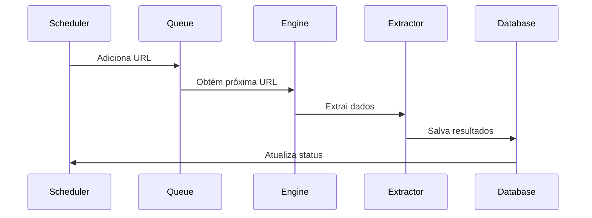
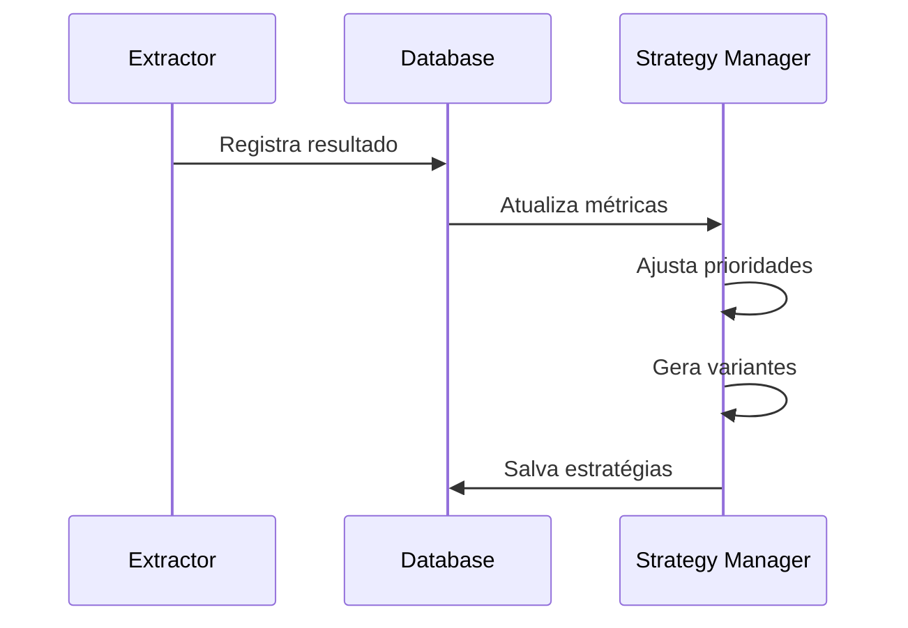
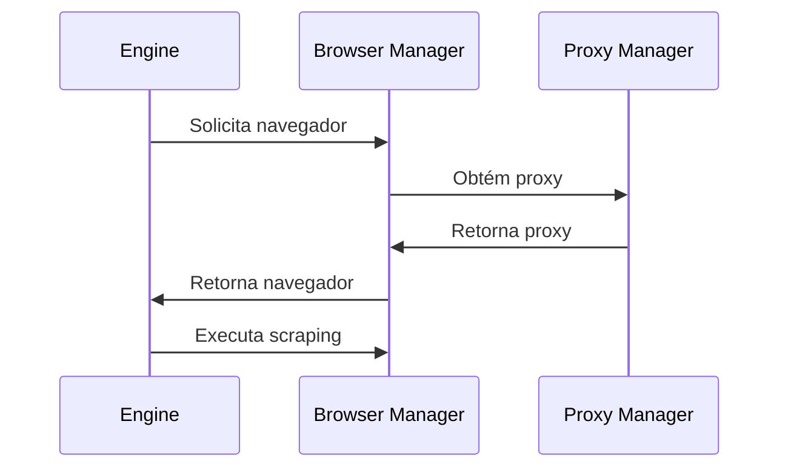

# Arquitetura do Sistema de Monitoramento de Preços

## Visão Geral

O sistema de monitoramento de preços é uma solução distribuída e resiliente para scraping de preços em marketplaces brasileiros. A arquitetura foi projetada para ser altamente escalável, anti-detectável e adaptativa.

## Componentes Principais

### 1. Scheduler (`scheduler.py`)
- Responsável pelo agendamento de varreduras
- Implementa distribuição inteligente de carga
- Gerencia priorização de URLs
- Controla períodos de cooldown

### 2. Queue Manager (`queue.py`)
- Gerencia fila de processamento
- Implementa controle de concorrência
- Prioriza URLs baseado em múltiplos fatores
- Gerencia rate limiting por domínio

### 3. Scraping Engine (`engine.py`)
- Core do sistema de scraping
- Gerencia sessões do Playwright
- Implementa rotação de proxies
- Controla retries e fallbacks

### 4. Extractor (`extractor.py`)
- Sistema de extração adaptativo
- Gerencia estratégias de extração
- Implementa validação de dados
- Mantém histórico de sucesso/falha

### 5. Database (`db.py`)
- Interface com Supabase
- Implementa operações CRUD
- Gerencia cache local
- Valida dados

### 6. Browser Manager (`browser/manager.py`)
- Gerencia instâncias do Playwright
- Implementa anti-detecção
- Controla fingerprinting
- Gerencia pool de navegadores

## Fluxos de Dados

### 1. Fluxo de Scraping

### 2. Fluxo de Aprendizado

### 3. Fluxo de Anti-Detecção

## Decisões Técnicas (ADRs)

### ADR-001: Uso do Playwright
**Status**: Aceito
**Contexto**: Necessidade de um navegador headless moderno com suporte a JavaScript e anti-detecção
**Decisão**: Utilizar Playwright ao invés de Selenium ou Puppeteer
**Consequências**:
- Melhor suporte a anti-detecção
- API mais moderna e estável
- Melhor performance
- Suporte nativo a múltiplos navegadores

### ADR-002: Arquitetura Assíncrona
**Status**: Aceito
**Contexto**: Necessidade de processamento concorrente eficiente
**Decisão**: Utilizar asyncio para operações assíncronas
**Consequências**:
- Melhor utilização de recursos
- Escalabilidade horizontal
- Código mais limpo e manutenível
- Melhor controle de concorrência

### ADR-003: Sistema de Aprendizado Adaptativo
**Status**: Aceito
**Contexto**: Necessidade de adaptação a mudanças em sites
**Decisão**: Implementar sistema de aprendizado baseado em estratégias
**Consequências**:
- Maior resiliência a mudanças
- Melhor taxa de sucesso
- Overhead de processamento
- Complexidade adicional

### ADR-004: Uso do Supabase
**Status**: Aceito
**Contexto**: Necessidade de banco de dados robusto e escalável
**Decisão**: Utilizar Supabase como banco de dados principal
**Consequências**:
- Escalabilidade automática
- RLS nativo
- API REST automática
- Dependência de serviço externo

## Considerações de Segurança

### 1. Anti-Detecção
- Fingerprinting dinâmico
- Rotação de proxies
- Simulação de comportamento humano
- Evasão de WebGL/Canvas

### 2. Proteção de Dados
- RLS no Supabase
- Sanitização de inputs
- Validação de dados
- Logging seguro

### 3. Rate Limiting
- Por domínio
- Por IP
- Por sessão
- Adaptativo

## Considerações de Performance

### 1. Otimizações
- Pool de conexões
- Cache local
- Bulk operations
- Lazy loading

### 2. Monitoramento
- Métricas de performance
- Logging estruturado
- Alertas proativos
- Tracing distribuído

## Próximos Passos

1. Implementar circuit breaker
2. Adicionar sistema de fallback
3. Melhorar monitoramento
4. Expandir testes
5. Documentar APIs 