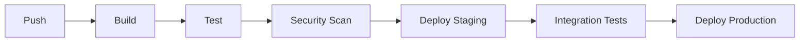

# Sistema de CI/CD

## Visão Geral

O sistema de CI/CD é responsável por automatizar o processo de build, teste e deploy do sistema de scraping, garantindo qualidade e confiabilidade.

## Pipeline

### 1. Estrutura


### 2. Workflows

#### Build e Teste
```yaml
# .github/workflows/build.yml
name: Build and Test

on:
  push:
    branches: [ main, develop ]
  pull_request:
    branches: [ main, develop ]

jobs:
  build:
    runs-on: ubuntu-latest
    
    steps:
    - uses: actions/checkout@v2
    
    - name: Set up Python
      uses: actions/setup-python@v2
      with:
        python-version: '3.11'
    
    - name: Install dependencies
      run: |
        python -m pip install --upgrade pip
        pip install -r requirements.txt
        pip install -r requirements-dev.txt
    
    - name: Run tests
      run: |
        pytest tests/ --cov=src --cov-report=xml
    
    - name: Upload coverage
      uses: codecov/codecov-action@v2
      with:
        file: ./coverage.xml
```

#### Security Scan
```yaml
# .github/workflows/security.yml
name: Security Scan

on:
  push:
    branches: [ main, develop ]
  pull_request:
    branches: [ main, develop ]

jobs:
  security:
    runs-on: ubuntu-latest
    
    steps:
    - uses: actions/checkout@v2
    
    - name: Run Bandit
      run: |
        pip install bandit
        bandit -r src/
    
    - name: Run Safety
      run: |
        pip install safety
        safety check
    
    - name: Run Snyk
      uses: snyk/actions/python@master
      env:
        SNYK_TOKEN: ${{ secrets.SNYK_TOKEN }}
```

#### Deploy
```yaml
# .github/workflows/deploy.yml
name: Deploy

on:
  push:
    branches: [ main ]

jobs:
  deploy-staging:
    runs-on: ubuntu-latest
    environment: staging
    
    steps:
    - uses: actions/checkout@v2
    
    - name: Configure AWS credentials
      uses: aws-actions/configure-aws-credentials@v1
      with:
        aws-access-key-id: ${{ secrets.AWS_ACCESS_KEY_ID }}
        aws-secret-access-key: ${{ secrets.AWS_SECRET_ACCESS_KEY }}
        aws-region: us-east-1
    
    - name: Deploy to staging
      run: |
        aws ecs update-service --cluster staging --service scraper --force-new-deployment

  deploy-production:
    needs: deploy-staging
    runs-on: ubuntu-latest
    environment: production
    
    steps:
    - uses: actions/checkout@v2
    
    - name: Configure AWS credentials
      uses: aws-actions/configure-aws-credentials@v1
      with:
        aws-access-key-id: ${{ secrets.AWS_ACCESS_KEY_ID }}
        aws-secret-access-key: ${{ secrets.AWS_SECRET_ACCESS_KEY }}
        aws-region: us-east-1
    
    - name: Deploy to production
      run: |
        aws ecs update-service --cluster production --service scraper --force-new-deployment
```

## Ambiente

### 1. Staging
```yaml
# docker-compose.staging.yml
version: '3.8'

services:
  scraper:
    build:
      context: .
      dockerfile: Dockerfile
    environment:
      - ENVIRONMENT=staging
      - DATABASE_URL=${STAGING_DATABASE_URL}
      - PROXY_URL=${STAGING_PROXY_URL}
    deploy:
      replicas: 2
      update_config:
        parallelism: 1
        delay: 10s
      restart_policy:
        condition: on-failure

  prometheus:
    image: prom/prometheus
    volumes:
      - ./prometheus.yml:/etc/prometheus/prometheus.yml
    ports:
      - "9090:9090"

  grafana:
    image: grafana/grafana
    environment:
      - GF_SECURITY_ADMIN_PASSWORD=${GRAFANA_PASSWORD}
    ports:
      - "3000:3000"
```

### 2. Production
```yaml
# docker-compose.production.yml
version: '3.8'

services:
  scraper:
    build:
      context: .
      dockerfile: Dockerfile
    environment:
      - ENVIRONMENT=production
      - DATABASE_URL=${PRODUCTION_DATABASE_URL}
      - PROXY_URL=${PRODUCTION_PROXY_URL}
    deploy:
      replicas: 5
      update_config:
        parallelism: 1
        delay: 30s
      restart_policy:
        condition: on-failure
      resources:
        limits:
          cpus: '1'
          memory: 2G

  prometheus:
    image: prom/prometheus
    volumes:
      - ./prometheus.yml:/etc/prometheus/prometheus.yml
    ports:
      - "9090:9090"

  grafana:
    image: grafana/grafana
    environment:
      - GF_SECURITY_ADMIN_PASSWORD=${GRAFANA_PASSWORD}
    ports:
      - "3000:3000"
```

## Monitoramento

### 1. Prometheus
```yaml
# prometheus.yml
global:
  scrape_interval: 15s
  evaluation_interval: 15s

scrape_configs:
  - job_name: 'scraper'
    static_configs:
      - targets: ['scraper:8000']
    metrics_path: '/metrics'

  - job_name: 'node-exporter'
    static_configs:
      - targets: ['node-exporter:9100']
```

### 2. Grafana
```yaml
# grafana/dashboards/scraper.json
{
  "dashboard": {
    "title": "Scraper Overview",
    "panels": [
      {
        "title": "Performance",
        "type": "graph",
        "datasource": "Prometheus",
        "targets": [
          {
            "expr": "rate(scraper_response_time_seconds[5m])",
            "legendFormat": "Response Time"
          }
        ]
      },
      {
        "title": "Success Rate",
        "type": "gauge",
        "datasource": "Prometheus",
        "targets": [
          {
            "expr": "scraper_success_rate",
            "legendFormat": "Success Rate"
          }
        ]
      }
    ]
  }
}
```

## Rollback

### 1. Estratégia
```yaml
# .github/workflows/rollback.yml
name: Rollback

on:
  workflow_dispatch:
    inputs:
      environment:
        description: 'Environment to rollback'
        required: true
        default: 'staging'
        type: choice
        options:
          - staging
          - production

jobs:
  rollback:
    runs-on: ubuntu-latest
    environment: ${{ github.event.inputs.environment }}
    
    steps:
    - uses: actions/checkout@v2
    
    - name: Configure AWS credentials
      uses: aws-actions/configure-aws-credentials@v1
      with:
        aws-access-key-id: ${{ secrets.AWS_ACCESS_KEY_ID }}
        aws-secret-access-key: ${{ secrets.AWS_SECRET_ACCESS_KEY }}
        aws-region: us-east-1
    
    - name: Rollback deployment
      run: |
        aws ecs update-service --cluster ${{ github.event.inputs.environment }} --service scraper --task-definition $(aws ecs describe-task-definition --task-definition scraper --query 'taskDefinition.taskDefinitionArn' --output text)
```

### 2. Notificações
```yaml
# .github/workflows/notifications.yml
name: Notifications

on:
  workflow_run:
    workflows: ["Deploy", "Rollback"]
    types:
      - completed

jobs:
  notify:
    runs-on: ubuntu-latest
    
    steps:
    - name: Send Slack notification
      uses: 8398a7/action-slack@v3
      with:
        status: ${{ github.event.workflow_run.conclusion }}
        fields: repo,message,commit,author,action,eventName,ref,workflow,job,took
      env:
        SLACK_WEBHOOK_URL: ${{ secrets.SLACK_WEBHOOK_URL }}
```

## Segurança

### 1. Secrets
```yaml
# .github/workflows/secrets.yml
name: Rotate Secrets

on:
  schedule:
    - cron: '0 0 * * 0'  # Weekly

jobs:
  rotate:
    runs-on: ubuntu-latest
    
    steps:
    - name: Rotate AWS credentials
      run: |
        aws iam rotate-access-key --user-name github-actions
    
    - name: Update GitHub secrets
      uses: aws-actions/configure-aws-credentials@v1
      with:
        aws-access-key-id: ${{ secrets.AWS_ACCESS_KEY_ID }}
        aws-secret-access-key: ${{ secrets.AWS_SECRET_ACCESS_KEY }}
        aws-region: us-east-1
```

### 2. Compliance
```yaml
# .github/workflows/compliance.yml
name: Compliance Check

on:
  push:
    branches: [ main, develop ]
  pull_request:
    branches: [ main, develop ]

jobs:
  compliance:
    runs-on: ubuntu-latest
    
    steps:
    - uses: actions/checkout@v2
    
    - name: Run license check
      run: |
        pip install pip-licenses
        pip-licenses --format=json > licenses.json
    
    - name: Run dependency check
      run: |
        pip install safety
        safety check --json > safety.json
```

## Próximos Passos

1. Implementar blue/green deployment
2. Adicionar canary releases
3. Melhorar monitoramento
4. Expandir testes
5. Implementar auto-scaling 