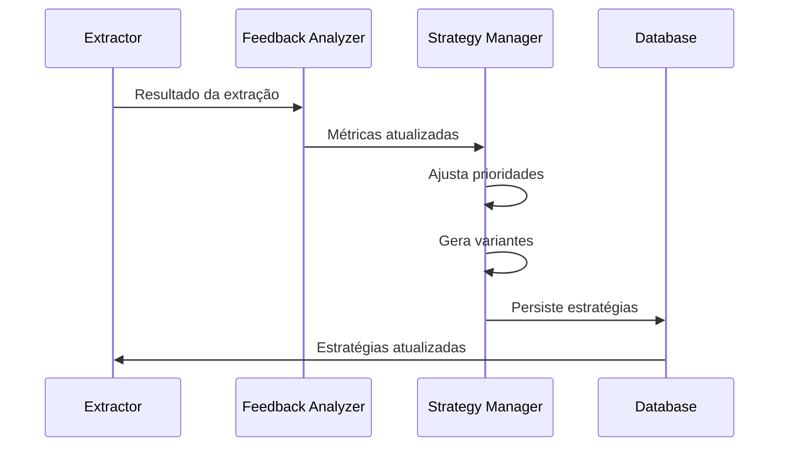

# Sistema de Aprendizado Adaptativo

## Visão Geral

O sistema de aprendizado adaptativo é um componente central do monitoramento de preços, responsável por otimizar continuamente as estratégias de extração baseado em resultados históricos e padrões de sucesso.

## Arquitetura

### 1. Componentes

#### Strategy Manager
- Gerencia o ciclo de vida das estratégias
- Implementa priorização dinâmica
- Controla geração de variantes
- Mantém métricas de performance

#### Strategy Store
- Persiste estratégias no Supabase
- Implementa cache local
- Gerencia versionamento
- Controla acesso concorrente

#### Feedback Analyzer
- Processa resultados de extração
- Calcula métricas de sucesso
- Identifica padrões de falha
- Sugere melhorias

### 2. Fluxo de Dados



## Estratégias de Extração

### 1. Tipos de Estratégias

#### Regex
- Padrões de texto
- Flags de case-sensitivity
- Grupos de captura
- Validação de formato

#### XPath
- Navegação DOM
- Predicados
- Funções
- Axes

#### CSS
- Seletores
- Pseudo-classes
- Atributos
- Combinadores

#### Semantic
- Atributos semânticos
- Contexto
- Proximidade
- Hierarquia

#### Composite
- Combinação de estratégias
- Ordem de execução
- Fallbacks
- Validação cruzada

### 2. Estrutura de Dados

```json
{
  "strategy": {
    "id": "uuid",
    "domain": "amazon.com.br",
    "type": "composite",
    "data": {
      "steps": [
        {
          "type": "css",
          "selector": ".price-current",
          "fallback": ".product-price"
        },
        {
          "type": "regex",
          "pattern": "R\\$\\s*(\\d+[.,]\\d{2})",
          "flags": "i"
        }
      ],
      "validation": {
        "type": "numeric",
        "min": 0,
        "max": 1000000
      }
    },
    "metrics": {
      "success_rate": 0.95,
      "avg_time": 0.5,
      "confidence": 0.9
    }
  }
}
```

## Algoritmo de Aprendizado

### 1. Atualização de Confiança

```python
def update_confidence(current_confidence, success):
    if success:
        return current_confidence * 0.9 + 0.1
    return current_confidence * 0.9
```

### 2. Priorização

```python
def calculate_priority(strategy):
    return (
        strategy.success_rate * 0.4 +
        strategy.confidence * 0.3 +
        (1 - strategy.avg_time) * 0.3
    )
```

### 3. Geração de Variantes

```python
def generate_variants(strategy):
    variants = []
    
    # Variação de seletores
    if strategy.type == "css":
        variants.extend(generate_selector_variants(strategy.selector))
    
    # Variação de padrões
    if strategy.type == "regex":
        variants.extend(generate_pattern_variants(strategy.pattern))
    
    # Variação de composição
    if strategy.type == "composite":
        variants.extend(generate_composite_variants(strategy.steps))
    
    return variants
```

## Métricas e Monitoramento

### 1. Métricas por Estratégia
- Taxa de sucesso
- Tempo médio de extração
- Nível de confiança
- Número de tentativas

### 2. Métricas por Domínio
- Performance geral
- Distribuição de estratégias
- Tendências de sucesso
- Padrões de falha

### 3. Alertas
- Queda na taxa de sucesso
- Aumento no tempo de extração
- Falhas consecutivas
- Mudanças estruturais

## Otimizações

### 1. Cache
- Cache de estratégias por domínio
- Cache de resultados de extração
- Cache de métricas
- Invalidação inteligente

### 2. Performance
- Bulk updates
- Lazy loading
- Background processing
- Parallel evaluation

### 3. Resiliência
- Fallback automático
- Retry inteligente
- Circuit breaker
- Rate limiting

## Próximos Passos

1. Implementar machine learning para geração de estratégias
2. Adicionar análise de similaridade entre sites
3. Melhorar detecção de mudanças estruturais
4. Expandir validação cruzada
5. Implementar A/B testing de estratégias 