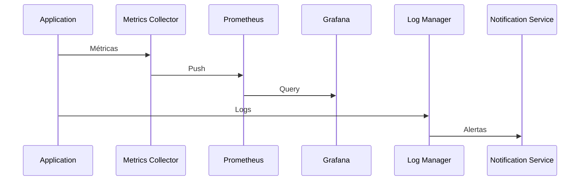

# Sistema de Monitoramento e Métricas

## Visão Geral

O sistema de monitoramento é responsável por coletar, processar e alertar sobre métricas de performance, saúde e comportamento do sistema de scraping.

## Arquitetura

### 1. Componentes

#### Metrics Collector
- Coleta métricas do sistema
- Implementa agregação
- Gerencia labels
- Controla sampling

#### Alert Manager
- Processa regras de alerta
- Gerencia notificações
- Implementa throttling
- Controla escalonamento

#### Log Manager
- Gerencia logs estruturados
- Implementa rotação
- Controla níveis
- Gerencia destinos

### 2. Fluxo de Dados



## Métricas

### 1. Métricas do Sistema

#### Performance
```python
# Tempo de resposta
response_time = Histogram(
    'scraper_response_time_seconds',
    'Tempo de resposta do scraping',
    ['domain', 'strategy']
)

# Taxa de sucesso
success_rate = Gauge(
    'scraper_success_rate',
    'Taxa de sucesso do scraping',
    ['domain', 'strategy']
)

# Uso de recursos
resource_usage = Gauge(
    'scraper_resource_usage',
    'Uso de recursos do sistema',
    ['resource_type']
)
```

#### Saúde
```python
# Saúde do proxy
proxy_health = Gauge(
    'scraper_proxy_health',
    'Saúde do proxy',
    ['proxy_id', 'domain']
)

# Saúde da estratégia
strategy_health = Gauge(
    'scraper_strategy_health',
    'Saúde da estratégia',
    ['strategy_id', 'domain']
)

# Saúde do navegador
browser_health = Gauge(
    'scraper_browser_health',
    'Saúde do navegador',
    ['browser_id']
)
```

#### Negócio
```python
# Preços coletados
prices_collected = Counter(
    'scraper_prices_collected',
    'Número de preços coletados',
    ['domain', 'product_type']
)

# Variações de preço
price_changes = Counter(
    'scraper_price_changes',
    'Número de variações de preço',
    ['domain', 'direction']
)

# Produtos monitorados
products_monitored = Gauge(
    'scraper_products_monitored',
    'Número de produtos monitorados',
    ['domain', 'status']
)
```

### 2. Dashboards

#### Overview
```yaml
dashboard:
  title: "Scraper Overview"
  panels:
    - title: "Performance Geral"
      type: "graph"
      metrics:
        - "scraper_response_time_seconds"
        - "scraper_success_rate"
    - title: "Saúde do Sistema"
      type: "status"
      metrics:
        - "scraper_proxy_health"
        - "scraper_strategy_health"
    - title: "Métricas de Negócio"
      type: "graph"
      metrics:
        - "scraper_prices_collected"
        - "scraper_price_changes"
```

#### Detalhado
```yaml
dashboard:
  title: "Scraper Detalhado"
  panels:
    - title: "Performance por Domínio"
      type: "graph"
      metrics:
        - "scraper_response_time_seconds{domain=~'.*'}"
    - title: "Saúde por Proxy"
      type: "heatmap"
      metrics:
        - "scraper_proxy_health{proxy_id=~'.*'}"
    - title: "Estratégias por Domínio"
      type: "table"
      metrics:
        - "scraper_strategy_health{strategy_id=~'.*'}"
```

## Logging

### 1. Estrutura

#### Log Entry
```python
{
    'timestamp': '2024-01-20T10:00:00Z',
    'level': 'INFO',
    'component': 'scraper',
    'action': 'scrape',
    'domain': 'amazon.com.br',
    'url': 'https://amazon.com.br/product/123',
    'status': 'success',
    'duration': 1.5,
    'metadata': {
        'strategy_id': 'uuid',
        'proxy_id': 'uuid',
        'browser_id': 'uuid'
    }
}
```

#### Log Levels
```python
LOG_LEVELS = {
    'DEBUG': 10,
    'INFO': 20,
    'WARNING': 30,
    'ERROR': 40,
    'CRITICAL': 50
}
```

### 2. Destinos

#### File
```python
def setup_file_logging():
    return {
        'version': 1,
        'handlers': {
            'file': {
                'class': 'logging.handlers.RotatingFileHandler',
                'filename': 'logs/scraper.log',
                'maxBytes': 10485760,  # 10MB
                'backupCount': 5,
                'formatter': 'detailed'
            }
        }
    }
```

#### Elasticsearch
```python
def setup_elasticsearch_logging():
    return {
        'version': 1,
        'handlers': {
            'elasticsearch': {
                'class': 'elasticsearch_logger.ElasticsearchHandler',
                'hosts': ['elasticsearch:9200'],
                'index': 'scraper-logs-{date}',
                'formatter': 'json'
            }
        }
    }
```

## Alertas

### 1. Regras

#### Performance
```yaml
alert: HighResponseTime
expr: scraper_response_time_seconds > 5
for: 5m
labels:
  severity: warning
annotations:
  summary: "Tempo de resposta alto"
  description: "Tempo de resposta acima de 5s por 5 minutos"
```

#### Saúde
```yaml
alert: ProxyHealth
expr: scraper_proxy_health < 0.8
for: 10m
labels:
  severity: critical
annotations:
  summary: "Saúde do proxy baixa"
  description: "Saúde do proxy abaixo de 80% por 10 minutos"
```

#### Negócio
```yaml
alert: PriceChange
expr: rate(scraper_price_changes[1h]) > 100
for: 1h
labels:
  severity: info
annotations:
  summary: "Alta variação de preços"
  description: "Mais de 100 variações de preço por hora"
```

### 2. Notificações

#### Email
```python
def send_email_alert(alert):
    return {
        'to': 'team@example.com',
        'subject': f'[ALERT] {alert.summary}',
        'body': f'''
        Severity: {alert.severity}
        Description: {alert.description}
        Metrics: {alert.metrics}
        '''
    }
```

#### Slack
```python
def send_slack_alert(alert):
    return {
        'channel': '#alerts',
        'blocks': [
            {
                'type': 'section',
                'text': {
                    'type': 'mrkdwn',
                    'text': f'*{alert.summary}*'
                }
            },
            {
                'type': 'section',
                'text': {
                    'type': 'mrkdwn',
                    'text': f'_{alert.description}_'
                }
            }
        ]
    }
```

## Integração

### 1. Prometheus
```yaml
scrape_configs:
  - job_name: 'scraper'
    scrape_interval: 15s
    static_configs:
      - targets: ['localhost:8000']
    metrics_path: '/metrics'
```

### 2. Grafana
```yaml
datasources:
  - name: Prometheus
    type: prometheus
    url: http://prometheus:9090
    access: proxy
```

### 3. Elasticsearch
```yaml
output.elasticsearch:
  hosts: ["elasticsearch:9200"]
  index: "scraper-logs-%{+YYYY.MM.dd}"
```

## Próximos Passos

1. Implementar tracing distribuído
2. Adicionar métricas de negócio
3. Melhorar visualização
4. Expandir alertas
5. Implementar análise de tendências 